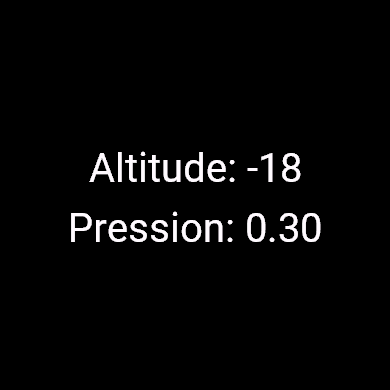

#garmin-widget

There is no glance code in the Samples, I found this code (in source) on Reddit.

Glance:
  

Altitude and Pression (Pressure in inHg)

Off to a good start. The altitude works when I'm outside and calibrate my watch. It changes when I go up and down the stairs, so it's pretty accurate. The watch's pressure sensor seems accurate too when comparing with other sources.